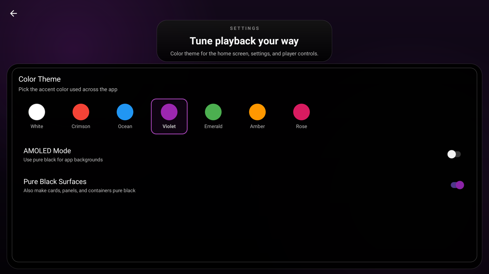

<div align="center">
  
</div>

# mpvNova
[](https://github.com/Laskco/mpvNova/releases/latest)
[](https://github.com/Laskco/mpvNova/releases/latest)

**mpvNova is an Android TV-first fork of [mpv-android](https://github.com/mpv-android/mpv-android), built on [libmpv](https://github.com/mpv-player/mpv). It keeps mpv's playback core while reshaping the app around couch-friendly navigation, a custom TV shell, and fast access to the controls that matter during playback.**

The goal is simple: keep mpv powerful, but make it feel natural on a TV from the moment it opens.

- TV-first home screen and launcher integration
- Remote-friendly player HUD with strong D-pad focus behavior
- Custom subtitle, audio, decoder, and settings panels
- Dialogue-focused audio tools for stereo and surround playback
- In-app update checks backed by GitHub releases
- Leanback launcher support and TV banner assets
- Built for sideloading on Android TV and Google TV devices

For the inherited playback feature set, scripting support, and core behavior that mpvNova builds on top of, see upstream [mpv-android](https://github.com/mpv-android/mpv-android).

---

## Showcase
<div align="center">
  
</div>

<div align="center">
  
</div>

<div align="center">
  
</div>

<div align="center">
  
</div>

<div align="center">
  
</div>

<div align="center">
  
</div>

<div align="center">
  
</div>

<div align="center">
  
</div>

<div align="center">
  
</div>

<div align="center">
  
</div>

---

## Installation

Download the latest APK from the [GitHub releases page](https://github.com/Laskco/mpvNova/releases).

[](https://github.com/Laskco/mpvNova/releases/latest)

- Use the **universal** APK if you want one build that works across device architectures
- Use an ABI-specific APK only if you already know the target device architecture
- After installation, future releases can also be checked from **Settings > App updates**

---

## Features

- Android TV / Google TV launcher support with leanback entry points and banner assets
- TV-first home screen with quick actions for folders, storage, URL playback, and settings
- Redesigned player HUD with chapter markers, title display, and a TV-scale seek bar
- In-player decoder picker with `HW+`, `HW`, `SW`, `G-NEXT`, and `Shield Anime (Hi10P)` modes
- Live `G-NEXT` path display for direct, copy, or software-backed playback paths
- Audio panel with Voice Boost, Volume Boost, DRC, Audio Normalization, Channel Downmix, surround-state feedback, and filter persistence
- Subtitle panel with dual-track display, one-tap primary/secondary swap, independent positioning, scale, delay, and filter persistence
- Home-screen update prompt plus manual update checks from Settings
- Decoder and stats overlays that are easier to read from a TV

---

## Building

### Prerequisites

- JDK 21
- Android SDK with current build tools
- Git for version information in builds
- Gradle wrapper `9.5.0`
- Android Gradle Plugin `9.2.0`
- Kotlin `2.3.21`

### App-only build

Use this when the bundled native libraries are already present and you mainly want to build or test the Android app layer.

**Windows**

```powershell
cmd /c gradlew.bat :app:assembleDefaultDebug
```

**Linux / macOS**

```bash
./gradlew :app:assembleDefaultDebug
```

### Full native rebuild

Use this when you need to rebuild `libmpv`, FFmpeg, or the JNI/native layer.

The native rebuild flow lives in [buildscripts/README.md](buildscripts/README.md). It is supported on Linux and macOS and is not intended to run natively on Windows.

Native rebuilds are only needed when updating or changing bundled native components such as mpv, FFmpeg, libass, or related JNI code. Regular Android UI work can use the app-only Gradle build.

### APK Variants

The Gradle config currently builds:

- `universal`: all bundled ABIs in one APK
- `arm64-v8a`
- `armeabi-v7a`
- `x86`
- `x86_64`

There is also an `api29` flavor for older-target compatibility builds.

---

## Releases

### Release signing

Release signing is optional for local debug builds, but required for signed release APKs.

- Keep your real signing files in `keystore.properties` and `keystore/`
- Start from [keystore.properties.example](keystore.properties.example) for the local file shape
- In CI or other non-local environments, use `MPVNOVA_STORE_FILE`, `MPVNOVA_STORE_PASSWORD`, `MPVNOVA_KEY_ALIAS`, and `MPVNOVA_KEY_PASSWORD`

### App updates

mpvNova checks GitHub releases from the home screen and from **Settings > App updates**. Update prompts are intentionally kept out of active playback so a release dialog never appears over the player UI.

The updater chooses the best APK asset for the device ABI when possible, opens Android's installer with a `FileProvider` URI, and cleans cached update APKs after the newly installed version relaunches.

---

## Official Builds And Branding

Official mpvNova builds are distributed through this repository's [GitHub Releases](https://github.com/Laskco/mpvNova/releases).

The `mpvNova` name, app icon, TV banner, package name `app.mpvnova.player`, release assets, and built-in update endpoint are reserved for official builds. Forks and redistributed builds must use their own app name, package name, signing key, artwork, and update source.

Do not upload mpvNova-branded builds to app stores or third-party stores without permission.

---

## Privacy

The project privacy policy is available at [docs/privacy.html](docs/privacy.html).

---

## Acknowledgments

- [mpv-android](https://github.com/mpv-android/mpv-android)
- [mpv](https://github.com/mpv-player/mpv)
- everyone whose work made the upstream Android port and playback stack possible
