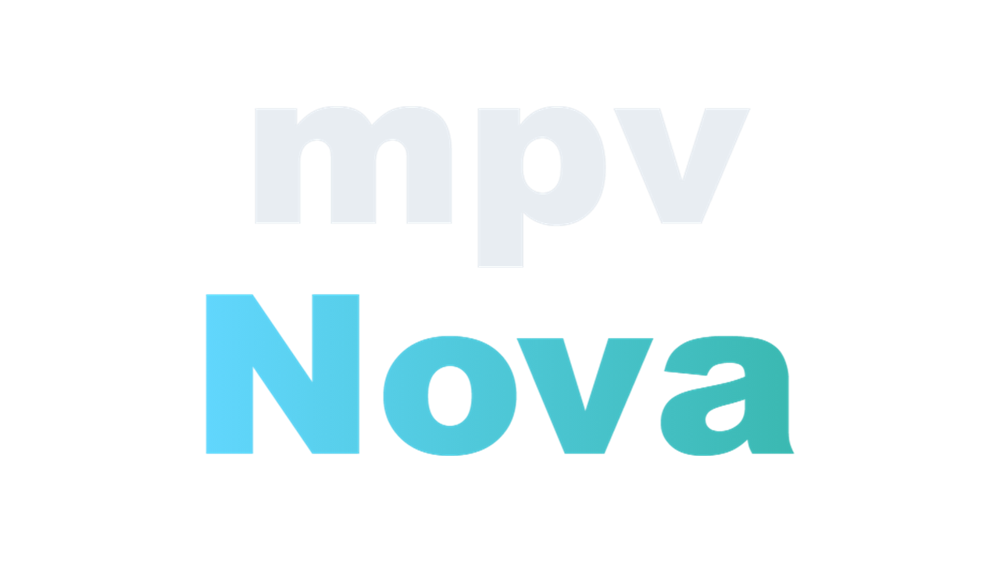
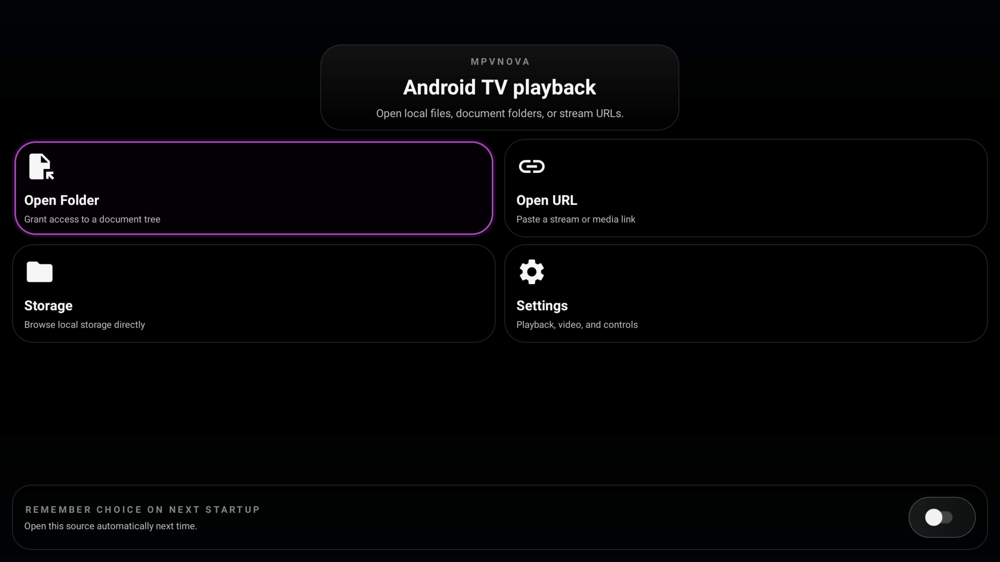
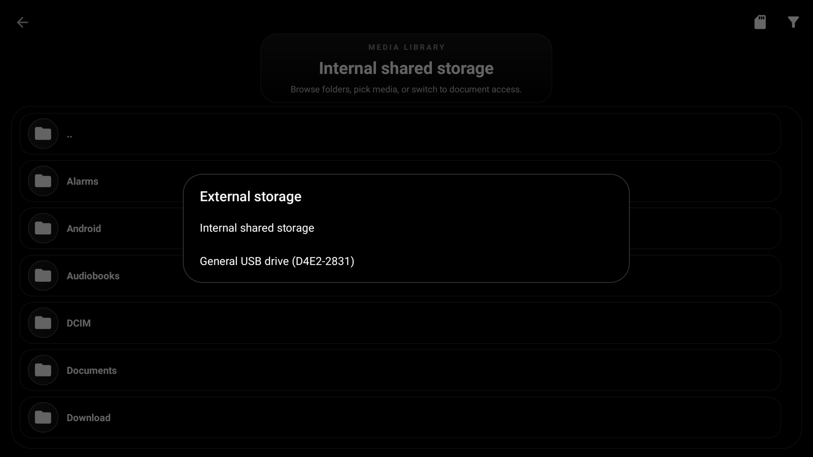
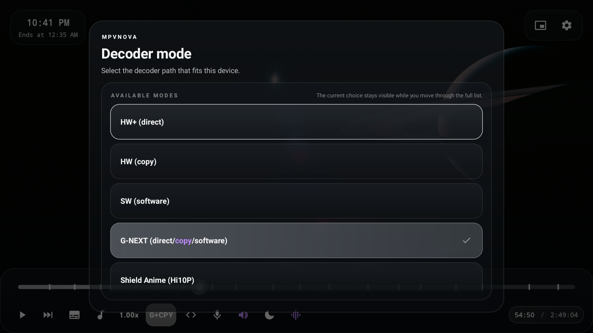
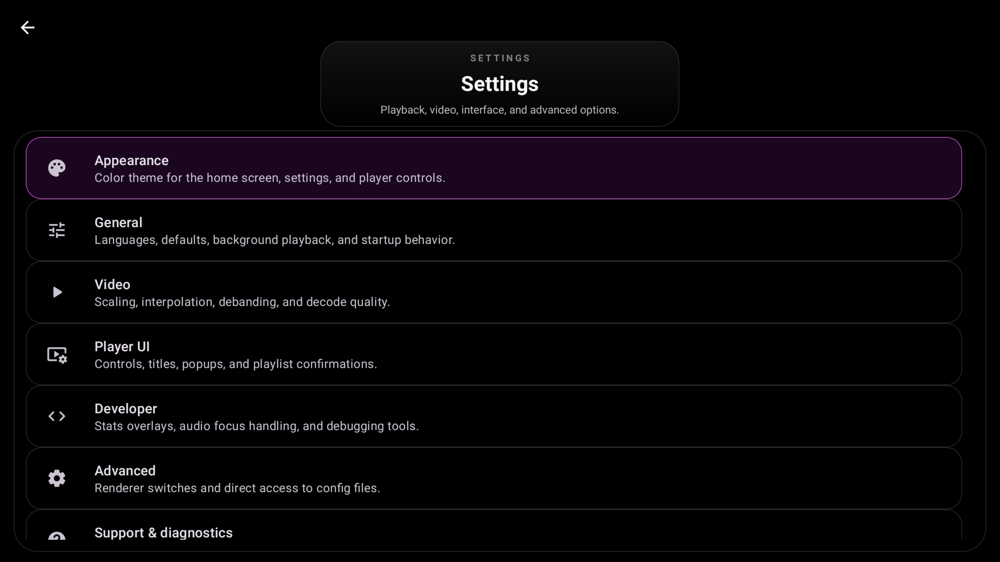
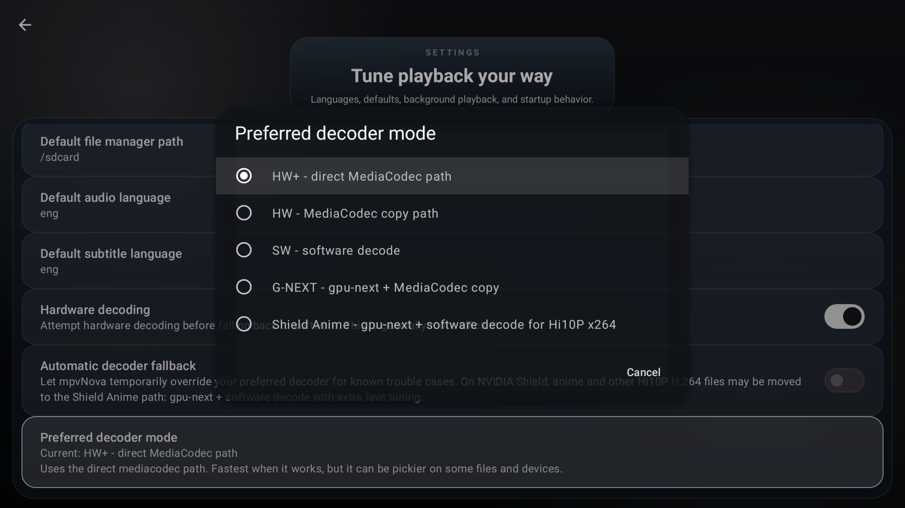

<div align="center">
  
</div>

# mpvNova
[](https://github.com/Laskco/mpvNova/releases/latest)
[](https://github.com/Laskco/mpvNova/releases/latest)

**mpvNova is an Android TV-first fork of [mpv-android](https://github.com/mpv-android/mpv-android), built on [libmpv](https://github.com/mpv-player/mpv). It keeps mpv's playback power, but reshapes the app around a cleaner couch-friendly experience with stronger remote navigation, a custom TV shell, and faster access to playback controls that matter on a TV.**

- TV-first home screen and launcher integration
- Remote-friendly player HUD and focus behavior
- Custom subtitle, audio, and decoder panels
- Dialogue-focused audio tools for surround playback
- Leanback launcher support and TV banner assets
- Built for sideloading on Android TV and Google TV devices

**This fork is focused on TV usability first. If you want the broader inherited playback feature set, scripting support, and core app behavior that mpvNova builds on top of, see the upstream [mpv-android](https://github.com/mpv-android/mpv-android) project.**

---

## Showcase
<div align="center">
  
</div>

<div align="center">
  
</div>

<div align="center">
  
</div>

<div align="center">
  
</div>

<div align="center">
  
</div>

<div align="center">
  
</div>

<div align="center">
  
</div>

<div align="center">
  
</div>

<div align="center">
  
</div>

---

## Installation

### Stable Release
Download the latest release from the [GitHub releases page](https://github.com/Laskco/mpvNova/releases).

[](https://github.com/Laskco/mpvNova/releases/latest)

- Use the **universal** APK if you want one build that works across device architectures
- Use an ABI-specific APK only if you already know the target device architecture

---

## Highlights

- Android TV / Google TV launcher support with leanback entry points and banner assets
- TV-first home screen with quick actions for folders, storage, URL playback, and settings
- Redesigned player HUD with stronger D-pad focus behavior, chapter markers, and a custom TV seek bar
- In-player decoder picker, including the dedicated `NVIDIA Shield Pro 2019 / Hi10P x264 anime` mode
- Custom TV subtitle and audio panels designed for couch use
- Built-in audio controls for voice boost, volume boost, night mode, audio normalization, dialogue downmix, surround-state feedback, and filter persistence
- Better visibility into playback state with decoder and stats overlays that are easier to read from a TV

---

## Building

### Prerequisites

- JDK 21
- Android SDK with current build tools
- Git for version information in builds

### App-only build

Use this when the bundled native libraries are already present and you mainly want to build or test the Android app layer.

**Windows**

```powershell
cmd /c gradlew.bat :app:assembleDefaultDebug
```

**Linux / macOS**

```bash
./gradlew :app:assembleDefaultDebug
```

### Full native rebuild

Use this when you need to rebuild `libmpv`, ffmpeg, or the JNI/native layer.

The native rebuild flow lives in [buildscripts/README.md](buildscripts/README.md) and is supported on Linux and macOS. It is not intended to run natively on Windows.

### APK Variants

The Gradle config currently builds:

- `universal`: all bundled ABIs in one APK
- `arm64-v8a`
- `armeabi-v7a`
- `x86`
- `x86_64`

There is also an `api29` flavor for older-target compatibility builds.

---

## Releases

### Release signing

Release signing is optional for local debug builds, but required for signed release APKs.

- Keep your real signing files in `keystore.properties` and `keystore/`
- Start from [keystore.properties.example](keystore.properties.example) for the local file shape
- In CI or other non-local environments, use `MPVNOVA_STORE_FILE`, `MPVNOVA_STORE_PASSWORD`, `MPVNOVA_KEY_ALIAS`, and `MPVNOVA_KEY_PASSWORD`

---

## Acknowledgments

- [mpv-android](https://github.com/mpv-android/mpv-android)
- [mpv](https://github.com/mpv-player/mpv)
- everyone whose work made the upstream Android port and playback stack possible
