<div align="center">
  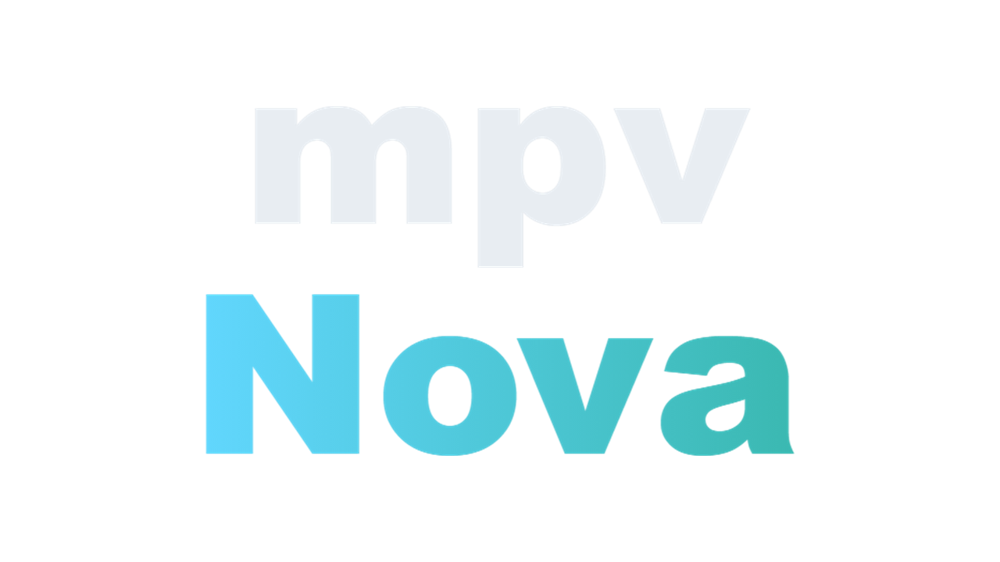
</div>

# mpvNova
[](https://github.com/Laskco/mpvNova/releases/latest)
[](https://github.com/Laskco/mpvNova/releases/latest)
[](https://github.com/Laskco/mpvNova/actions/workflows/build.yml)
[](https://github.com/Laskco/mpvNova/actions/workflows/quality.yml)
[](https://ko-fi.com/laskco)
[](https://buymeacoffee.com/laskco)
[](https://www.paypal.com/donate/?hosted_button_id=R87TNQANCT8KN)

mpvNova is a video player for Android TV, Google TV, and Android-based Fire TV devices. It is a fork of [mpv-android](https://github.com/mpv-android/mpv-android), built on [libmpv](https://github.com/mpv-player/mpv), with a TV interface, remote controls, and player customization.

## Documentation

- [Settings guide](docs/settings-guide.md): controls, options, defaults, and device compatibility.
- [Native build guide](buildscripts/README.md): rebuilding mpv and the bundled playback libraries.
- [Contributing](CONTRIBUTING.md): PR requirements, checks, and test APKs.

---

## TV Devices Only

mpvNova supports Android TV, Google TV, and Android-based Fire TV devices running Fire OS. Phones and tablets are not supported, and there are no plans for a mobile interface.

Vega OS Fire TV devices cannot install Android APKs and are not supported.

Fire OS support is best-effort. Some playback problems require fixes in mpv, FFmpeg, libplacebo, or device firmware and cannot be resolved in the app alone.

For phones and tablets, see [mpvEx](https://github.com/marlboro-advance/mpvEx), [mpvKt](https://github.com/abdallahmehiz/mpvKt), or [mpvRx](https://github.com/Riteshp2001/mpvRx).

---

## Screenshots
<div align="center">
  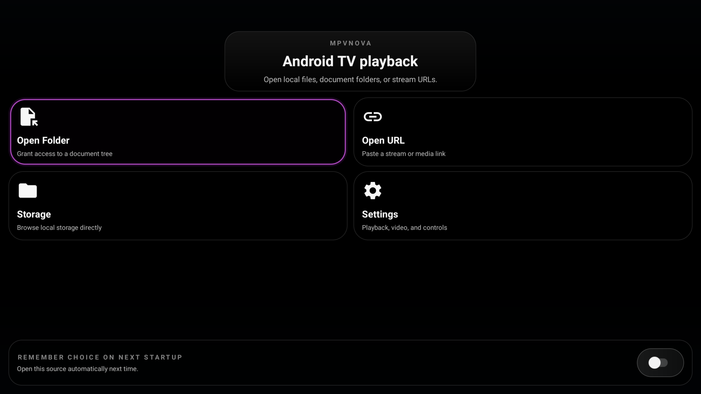
</div>

<div align="center">
  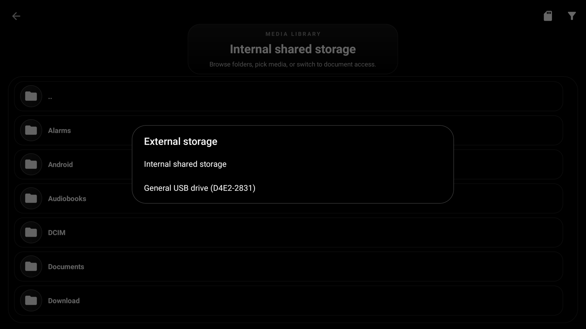
</div>

<div align="center">
  
</div>

<div align="center">
  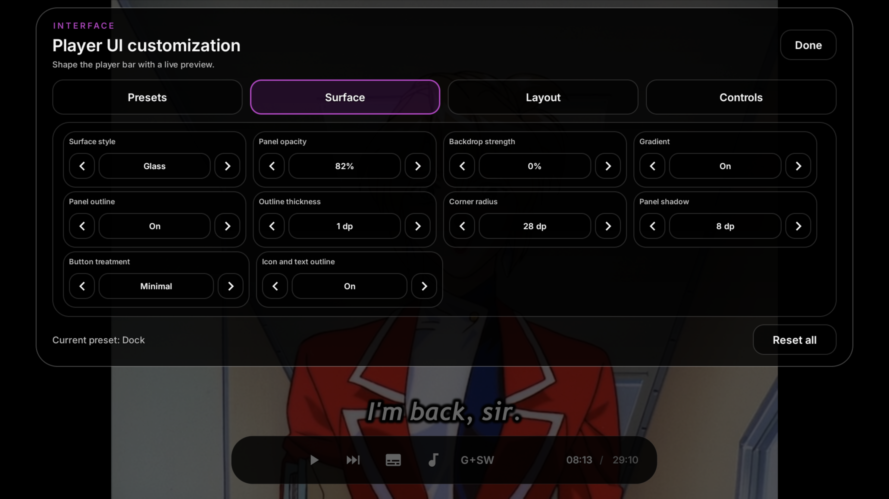
</div>

<div align="center">
  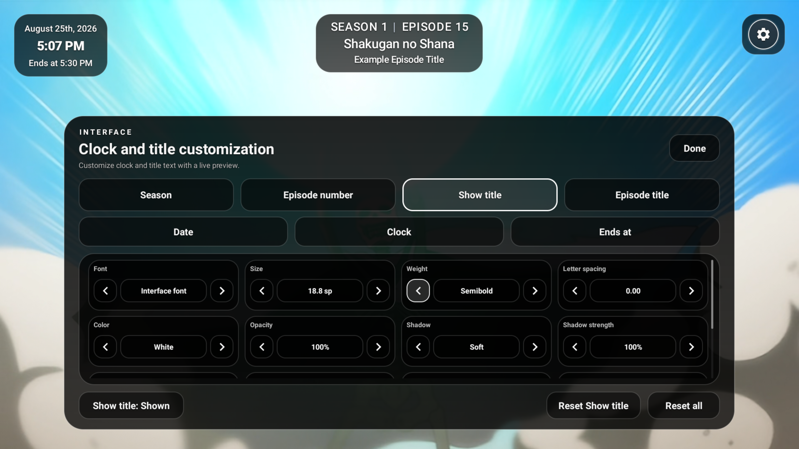
</div>

<div align="center">
  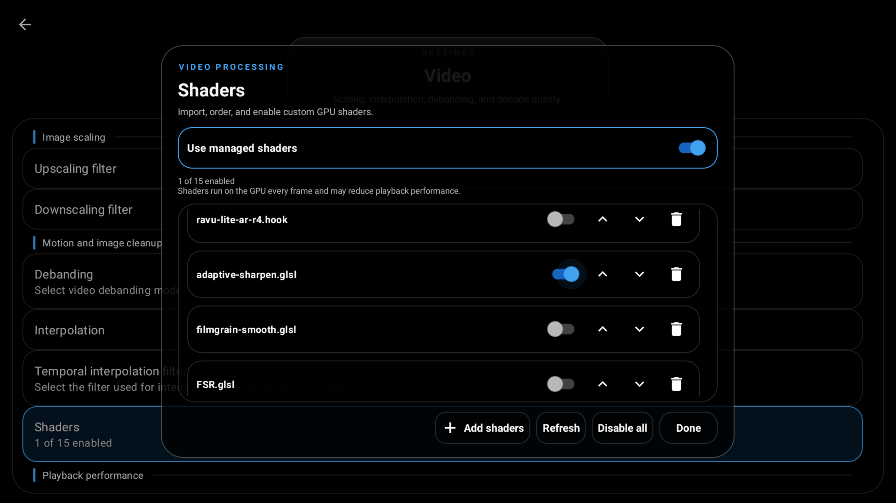
</div>

<div align="center">
  
</div>

<div align="center">
  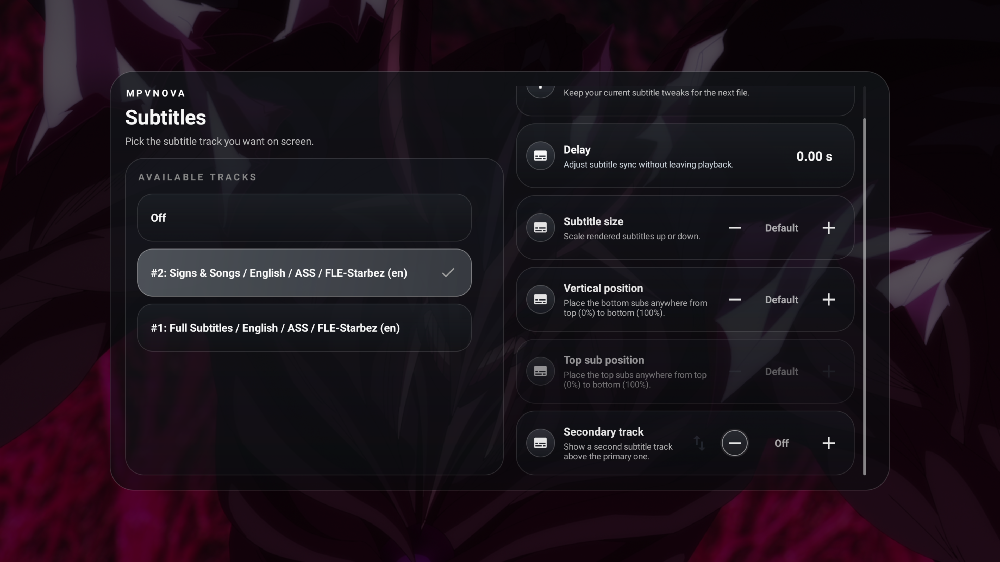
</div>

<div align="center">
  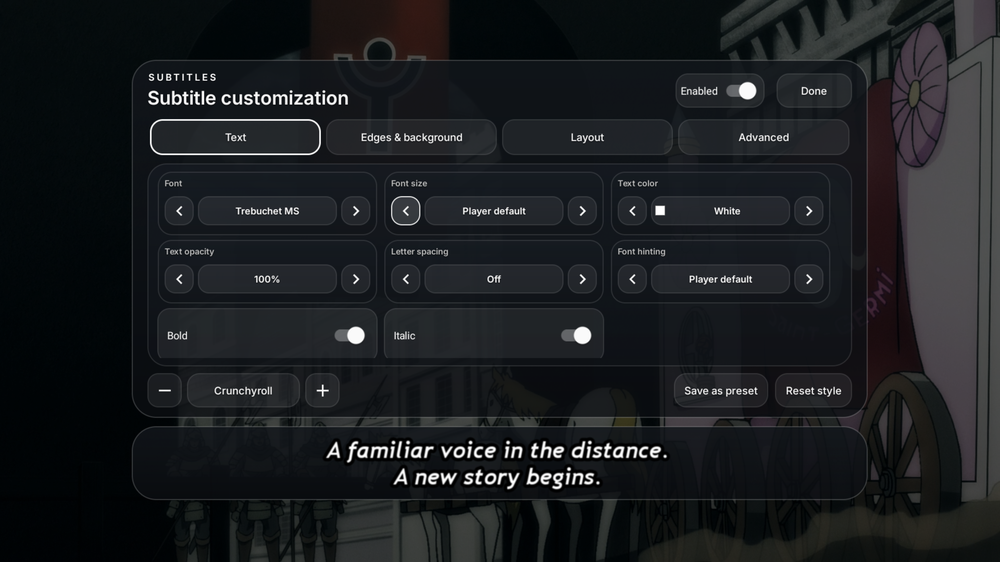
</div>

<div align="center">
  
</div>

<div align="center">
  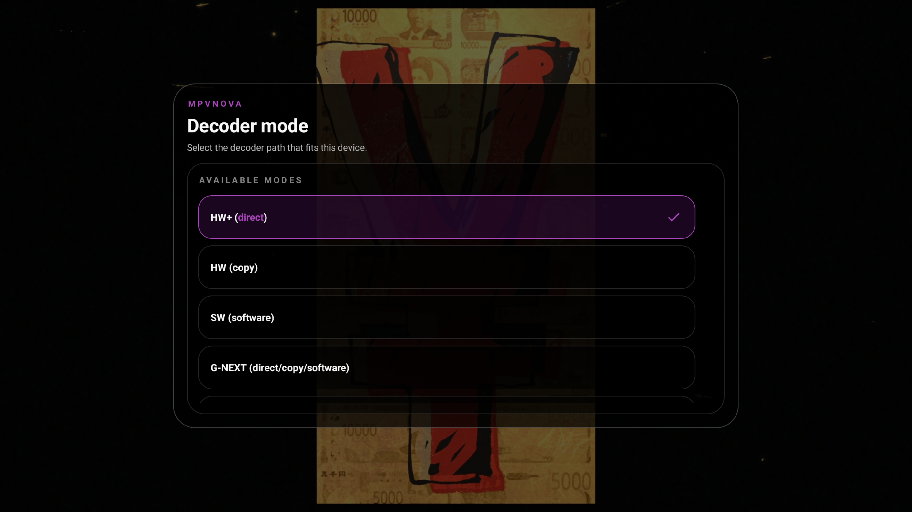
</div>

<div align="center">
  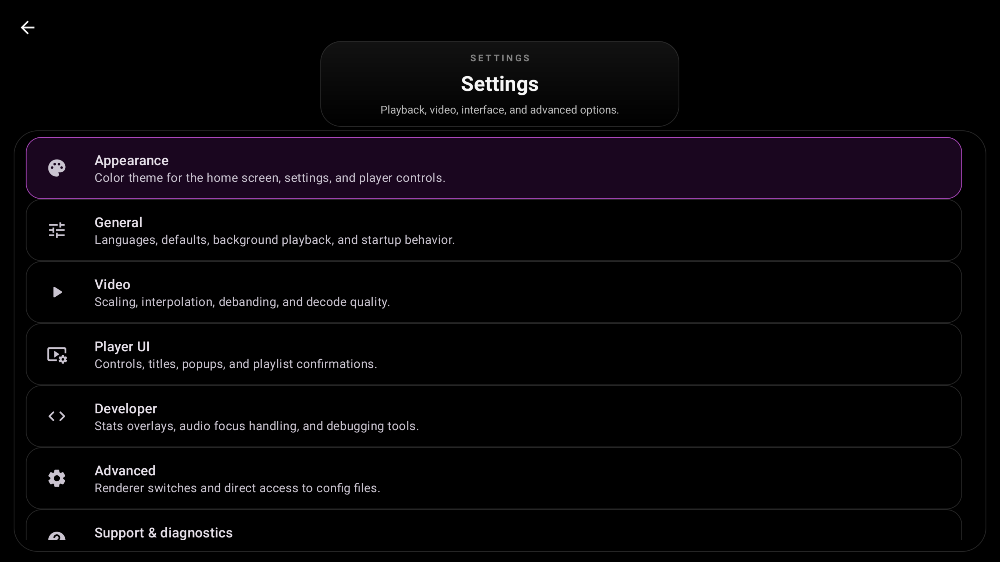
</div>

<div align="center">
  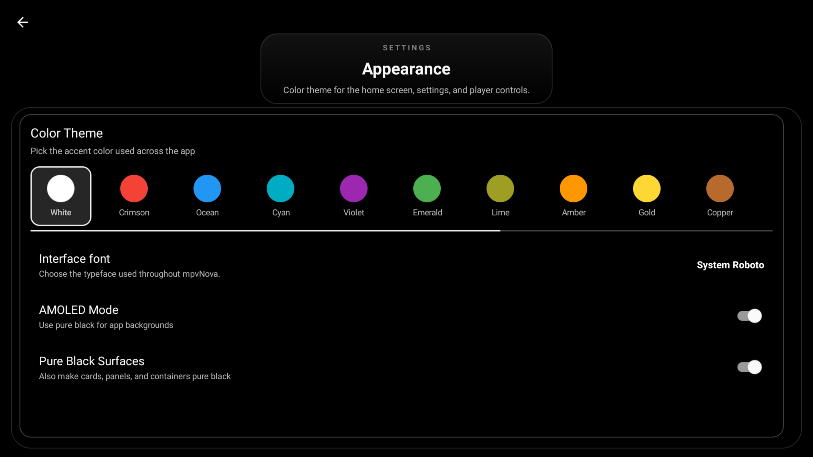
</div>

<div align="center">
  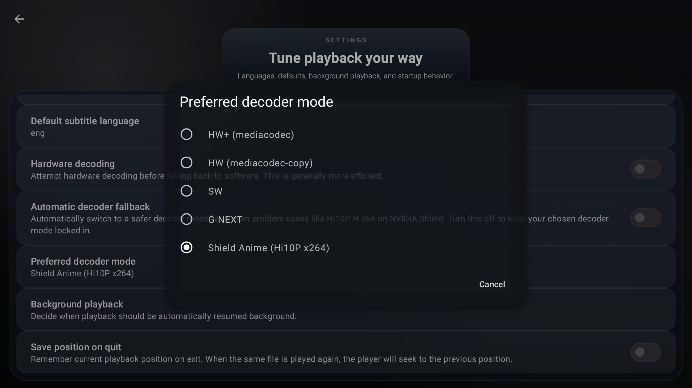
</div>

<div align="center">
  
</div>

---

## Installation

Download the latest APK from the [GitHub releases page](https://github.com/Laskco/mpvNova/releases).

[](https://github.com/Laskco/mpvNova/releases/latest)

- Use the **universal** APK if you are unsure which build you need.
- Smaller builds are available for `arm64-v8a`, `armeabi-v7a`, `x86`, and `x86_64`.
- For most Android-based Fire TV sticks, use **universal** or `armeabi-v7a`.
- Check for updates under **Settings > App updates**.

Optional: [Compile mpvNova for speed after sideloading](docs/speed-compilation.md).

---

## Features

- TV interface and remote navigation
- Customizable appearance and player controls
- Subtitle styling and track preferences
- Intro, outro, and credit skipping
- Audio controls and video adjustments
- Decoder and buffering settings
- Shader management
- Playback resume and per-series preferences
- Settings backup and restore
- In-app updates

See the [settings guide](docs/settings-guide.md) for individual controls and defaults.

---

## Network And Buffering

Open **Settings > Network** or the **Network** tab in the player drawer. Choose a buffering preset or set your own buffer sizes, read-ahead, and connection options.

Most changes apply during playback. **Stream read buffer** and **Connection timeout** require reopening the stream. Larger buffers use more RAM; they do not fix a consistently slow connection.

See [Network and buffering](docs/settings-guide.md#network-and-buffering) for the full list of controls.

---

## Dolby Vision And FEL

**Dolby Vision FEL decoding is disabled by default.** For interleaved Profile 7 video, mpvNova keeps the base video and RPU metadata without decoding the enhancement layer. Other Dolby Vision profiles are unaffected.

To enable FEL decoding, add `vd-lavc-dovi-fel=yes` under **Settings > Advanced > Edit mpv.conf**, then reopen the video. Remove the line or set it to `no` to restore the default. Enabling FEL can cause playback failures on some devices.

If a separate enhancement track contains the only RPU metadata, playback falls back to the base layer without it. This is not a DV7-to-DV8.1 conversion, and Dolby Vision output still depends on the device and display. See [decoder compatibility](docs/settings-guide.md#decoders-and-device-compatibility).

---

## Building

### Prerequisites

- JDK 21
- Android SDK with current build tools
- Git for version information in builds
- Gradle wrapper `9.7.1`
- Android Gradle Plugin `9.4.0`
- Kotlin `2.4.20`

### App-only build

The repository includes the native libraries. Use Gradle to build the app without rebuilding them.

**Windows**

```powershell
./gradlew.bat :app:assembleDefaultDebug
```

**Linux / macOS**

```bash
./gradlew :app:assembleDefaultDebug
```

### Full native rebuild

To rebuild mpv, FFmpeg, or the JNI libraries, follow the [native build guide](buildscripts/README.md). Native playback builds require Linux or macOS. They are not needed for Android UI changes.

### APK Variants

Available APKs:

- `universal`: all bundled ABIs in one APK
- `arm64-v8a`
- `armeabi-v7a`
- `x86`
- `x86_64`

All APKs support Android 6 and newer. On Android 11 and newer, local file browsing uses the All files access permission.

---

## Releases

### Release signing

Debug builds do not need a release key. To sign release APKs:

- Use [keystore.properties.example](keystore.properties.example) to create a local `keystore.properties`, and keep your key in `keystore/`.
- In CI, set `MPVNOVA_STORE_FILE`, `MPVNOVA_STORE_PASSWORD`, `MPVNOVA_KEY_ALIAS`, and `MPVNOVA_KEY_PASSWORD`.

Prepare release APKs with `./gradlew :app:prepareReleaseAssets` and publish the APKs from `app/build/outputs/release/`.
This also copies the universal APK to `app-api29-universal-release.apk` for older installed updaters. Keep that copy in future releases so users can skip versions without losing the update path. It is the same APK, not a separate API-29 build.

### App updates

Updates are checked from the home screen or **Settings > App updates**, not during playback. The updater downloads the appropriate APK and opens Android's installer.

---

## Official Builds And Branding

Official mpvNova builds are distributed through this repository's [GitHub Releases](https://github.com/Laskco/mpvNova/releases).

The `mpvNova` name, app icon, TV banner, package name `app.mpvnova.player`, release assets, and built-in update endpoint are reserved for official builds. Forks and redistributed builds must use their own app name, package name, signing key, artwork, and update source.

Do not upload mpvNova-branded builds to app stores or third-party stores without permission.

For a transparent launcher icon, use [mpvnova-transparent-icon.png](assets/mpvnova-transparent-icon.png). In Projectivy, long-press the mpvNova tile and select **Edit > Icon > Local file**.

---

## Privacy

[Privacy policy](docs/privacy.html).

---

## Acknowledgments

- [mpv-android](https://github.com/mpv-android/mpv-android)
- [mpv](https://github.com/mpv-player/mpv)
- The contributors to mpv-android, mpv, and their dependencies.
